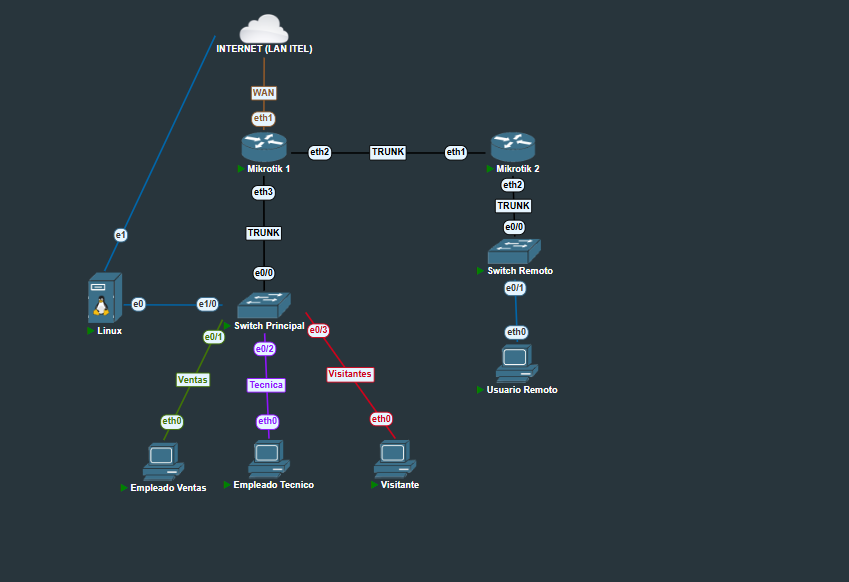

# 🚀 TP Redes Integrador + Netmiko

**Autor:** Luciano Joaquín Toledo  
**Proyecto:** Automatización profesional de red segmentada con Python, Netmiko y MikroTik

---

## 🌐 Descripción

Este proyecto automatiza la configuración y verificación de una red segmentada, integrando switches Cisco y routers MikroTik. Utiliza Python y la librería Netmiko para aplicar cambios en VLANs, trunks, NAT, DHCP y realizar verificaciones en los dispositivos de red.  
Todo queda documentado en consola y en el archivo de log `netmiko_log.txt` con timestamp.

---

## ✨ Características clave

- **Automatización integral:** Configura VLANs, trunks, NAT y DHCP en múltiples switches y routers.
- **Compatibilidad con Cisco legacy:** Incluye parche SSH para switches antiguos.
- **Logging detallado:** Cambios, errores y verificaciones con timestamp en log.
- **Verificación post-configuración:** Estado real de VLANs, trunks, NAT, IP y rutas.
- **Código modular y personalizable:** Parámetros y comandos editables.
- **Multi-vendor:** Funciona en MikroTik RouterOS y Cisco IOS.

---

## 🏗️ Topología sugerida



**Descripción rápida de la topología**  
- Dos routers MikroTik (principal y remoto) conectados por trunk.
- Dos switches Cisco (principal y remoto).
- Segmentos de red para Ventas, Técnica y Visitantes.
- Un servidor Linux y hosts por VLAN.
- Trunks correctamente configurados para transportar varias VLANs.

---

## 🛠️ Tecnologías y dependencias

- **Python >= 3.8**
- **Netmiko >= 4.x**
- **Paramiko >= 3.x**
- **Switches Cisco IOS**
- **Routers MikroTik RouterOS**

---

## 📦 Instalación

1. **Instala Python 3 si no lo tienes.**
2. **Instala dependencias:**
   ```sh
   pip install netmiko paramiko
   ```
3. **Verifica conectividad SSH** en todos los equipos.

---

## ⚡ Ejecución rápida

1. **Clona el repositorio o descarga el script.**
2. **Edita usuarios, contraseñas, IPs y VLANs según tu red.**
3. **Ejecuta:**
   ```sh
   python script.py
   ```
4. **Revisa consola y `netmiko_log.txt` para ver detalles, errores y resultados.**

---

## 🔧 Parámetros y personalización

- **Usuarios y contraseñas:** Definidos al inicio del script.
- **Lista de dispositivos:** Agrega/quita switches y routers en las listas `switches` y `routers`.
- **Comandos personalizados:** Edita las listas de comandos para VLANs, trunks, NAT y DHCP.
- **VLANs, IDs y puertos:** Modificables en las listas del script.
- **Logs y verificaciones:** Personalizables según tus requerimientos de auditoría.

---

## 🛡️ Compatibilidad con Cisco legacy

¿Tu switch Cisco arroja este error SSH?

```
Unable to negotiate ... no matching key exchange method found ...
```

¡No te preocupes!  
El script aplica un **parche Paramiko** para algoritmos legacy SSH.  
No necesitas actualizar IOS, simplemente ejecuta el script y conecta.

---

## 📝 ¿Qué automatiza el script?

- **VLANs:** Creación y nombrado en switches Cisco.
- **Trunks:** Configuración de trunks principales.
- **Puertos:** Asignación de puertos de acceso a VLANs.
- **MikroTik:** Automatiza VLANs, direcciones IP, NAT y DHCP server.
- **Verificación:** Estado de VLANs, trunks, NAT y rutas en consola.

---

## 📊 Ejemplo de salida en consola

```
=== Automatización de configuración de red ===

=== Configurando Switch 10.10.18.57 ===
✔ vlan 290
✔ name Ventas
...
-- Verificación --
VLAN Name Status Ports
...
```

---

## 🔎 Troubleshooting & Preguntas frecuentes

### 🔄 ¿No conecta por SSH al switch Cisco?
- Verifica usuario/contraseña.
- Asegúrate de que SSH está habilitado y la clave RSA generada.
- El parche SSH legacy resuelve problemas de negociación.

### 🛠️ ¿Cómo agrego más dispositivos?
- Añade nuevos diccionarios a las listas `switches` y/o `routers` en el script.

### 📝 ¿Dónde veo el historial de cambios?
- En el archivo `netmiko_log.txt` con fecha y hora.

---

## 💡 Consejos de escalabilidad

- **Cambia nombres de VLANs, IDs y puertos** según tu topología.
- **Agrega comandos adicionales** para nuevas configuraciones.
- **Adapta logs y verificaciones** si necesitas más detalle para auditoría.
- **Aprovecha la modularidad** para integrarlo en proyectos más grandes.

---

## 🏅 Créditos y agradecimientos

- **Netmiko:** [GitHub](https://github.com/ktbyers/netmiko)
- **Paramiko:** [GitHub](https://github.com/paramiko/paramiko)
- **Cisco y MikroTik CLI Reference**

---

## 📬 Contacto

¿Consultas, sugerencias o mejoras?  
**Autor:** Luciano Joaquín Toledo  
**Mail:** [ljtoledo@itel.edu.ar](mailto:ljtoledo@itel.edu.ar)

---

## 📝 Licencia

Proyecto educativo, académico y profesional.  
¡Si te fue útil, compártelo y mejoralo!

---

# 📚 Configuración detallada de dispositivos

A continuación se incluyen las configuraciones de los dispositivos principales del laboratorio, para referencia y documentación.

---

## 🖧 MikroTik 1 (Principal)

```shell
# aug/25/2025 20:12:24 by RouterOS 7.6
/interface bridge
add name=bridge-gestion vlan-filtering=yes
/interface vlan
add interface=ether3 name=GestionVLAN vlan-id=1899
add interface=ether2 name=GestionVLAN-Trunk vlan-id=1899
add interface=ether2 name=Tecnica vlan-id=291
add interface=ether2 name=Ventas vlan-id=290
add interface=ether2 name=Visitantes vlan-id=292
/interface wireless security-profiles
set [ find default=yes ] supplicant-identity=MikroTik
/ip pool
add name=lan-pool ranges=10.10.18.60-10.10.18.100
add name=pool_ventas ranges=10.10.18.66-10.10.18.94
/ip dhcp-server
add address-pool=lan-pool interface=ether2 name=dhcp-lan
add address-pool=pool_ventas interface=Ventas lease-time=1h name=dhcp_ventas
/port
set 0 name=serial0
set 1 name=serial1
/interface bridge port
add bridge=bridge-gestion interface=GestionVLAN
add bridge=bridge-gestion interface=GestionVLAN-Trunk
/ip address
add address=10.10.18.59/29 interface=GestionVLAN network=10.10.18.56
add address=10.10.18.59/24 interface=ether2 network=10.10.18.0
add address=10.10.18.65/27 interface=Ventas network=10.10.18.64
add address=10.10.18.97/28 interface=Tecnica network=10.10.18.96
add address=10.10.18.113/29 interface=Visitantes network=10.10.18.112
/ip dhcp-client
add interface=ether1
/ip dhcp-server network
add address=10.10.18.0/24 dns-server=8.8.8.8 gateway=10.10.18.59
add address=10.10.18.64/27 dns-server=8.8.8.8 gateway=10.10.18.65
/ip firewall nat
add action=masquerade chain=srcnat out-interface=ether1 src-address=10.10.18.0/24
add action=masquerade chain=srcnat comment="NAT Ventas" src-address=10.10.18.64/27
add action=masquerade chain=srcnat comment="NAT Tecnica" src-address=10.10.18.96/28
(repetidas reglas de NAT por subred)
```

---

## 🖧 MikroTik 2 (Remoto)

```shell
# aug/25/2025 20:38:58 by RouterOS 7.6
/interface bridge
add name=bridge-gestion vlan-filtering=yes
/interface vlan
add interface=ether2 name=GestionVLAN vlan-id=1899
add interface=ether1 name=GestionVLAN-Trunk vlan-id=1899
add interface=ether2 name=Tecnica vlan-id=291
add interface=ether2 name=Ventas vlan-id=290
add interface=ether2 name=Visitantes vlan-id=292
/interface wireless security-profiles
set [ find default=yes ] supplicant-identity=MikroTik
/ip pool
add name=pool_ventas ranges=10.10.18.66-10.10.18.94
/ip dhcp-server
add address-pool=pool_ventas interface=Ventas lease-time=1h name=dhcp_ventas
/port
set 0 name=serial0
set 1 name=serial1
/interface bridge port
add bridge=bridge-gestion interface=GestionVLAN
add bridge=bridge-gestion interface=GestionVLAN-Trunk
/ip address
add address=10.10.18.60/29 interface=GestionVLAN network=10.10.18.56
add address=10.10.18.65/27 interface=Ventas network=10.10.18.64
add address=10.10.18.97/28 interface=Tecnica network=10.10.18.96
add address=10.10.18.113/29 interface=Visitantes network=10.10.18.112
/ip dhcp-client
add interface=ether1
add interface=ether3
/ip dhcp-server network
add address=10.10.18.64/27 dns-server=8.8.8.8 gateway=10.10.18.65
/ip firewall nat
add action=masquerade chain=srcnat comment="NAT Ventas" src-address=10.10.18.64/27
add action=masquerade chain=srcnat comment="NAT Tecnica" src-address=10.10.18.96/28
(repetidas reglas de NAT por subred)
```

---

## 🖧 Switch Cisco Principal (SW1)

```shell
Switch#show startup-config
version 15.2
service timestamps debug datetime msec
service timestamps log datetime msec
no service password-encryption
service compress-config
hostname Switch
username itel privilege 15 password 0 mi-super-contraseC1a
username netadmin privilege 15 secret 5 $1$p2yS$bNMV5y2H3Yo/ALo5azuAQ/
no aaa new-model
clock timezone -03 -3 0
no ip icmp rate-limit unreachable
no ip domain-lookup
ip domain-name evg.local
ip cef
no ipv6 cef
spanning-tree mode pvst
spanning-tree extend system-id
vlan 1899
 name Gestion
interface Ethernet0/0
 switchport trunk allowed vlan 10,20,30,1899
 switchport trunk encapsulation dot1q
 switchport mode trunk
interface Ethernet1/0
 switchport access vlan 1899
 switchport mode access
interface Vlan1899
 ip address 10.10.18.57 255.255.255.248
ip ssh time-out 60
ip ssh version 2
ip ssh server algorithm encryption aes128-ctr aes192-ctr aes256-ctr
ip ssh client algorithm encryption aes128-ctr aes192-ctr aes256-ctr
line con 0
 exec-timeout 0 0
 privilege level 15
 logging synchronous
line aux 0
 exec-timeout 0 0
 privilege level 15
 logging synchronous
line vty 0 4
 login local
 transport input ssh
end
```

---

## 🖧 Switch Cisco Remoto (SW2)

```shell
Switch#show startup-config
version 15.2
service timestamps debug datetime msec
service timestamps log datetime msec
no service password-encryption
service compress-config
hostname Switch
username itel privilege 15 password 0 tu-contraseC1a-segura
username netadmin privilege 15 secret 5 $1$GzkN$Ma/9RVIZrMOg/znqERqaV.
no aaa new-model
clock timezone -03 -3 0
no ip icmp rate-limit unreachable
no ip domain-lookup
ip domain-name evg.local
ip cef
no ipv6 cef
spanning-tree mode pvst
spanning-tree extend system-id
vlan 1899
 name Gestion
interface Ethernet0/0
 switchport trunk allowed vlan 10,20,30,1899
 switchport trunk encapsulation dot1q
 switchport mode trunk
interface Ethernet0/1
 switchport access vlan 1899
 switchport mode access
interface Vlan1899
 ip address 10.10.18.58 255.255.255.248
ip ssh time-out 60
ip ssh version 2
ip ssh server algorithm encryption aes128-ctr aes192-ctr aes256-ctr
ip ssh client algorithm encryption aes128-ctr aes192-ctr aes256-ctr
line con 0
 exec-timeout 0 0
 privilege level 15
 logging synchronous
line aux 0
 exec-timeout 0 0
 privilege level 15
 logging synchronous
line vty 0 4
 login local
 transport input ssh
end
```

---

## ℹ️ Notas y recomendaciones

- Las reglas de NAT están repetidas en MikroTik, pero basta con una por subred.
- La configuración está preparada para segmentar, rutear y dar servicios de red a cada VLAN y sede.
- Puedes copiar y pegar estas configuraciones para pruebas o para ajustar tu entorno real.

---
